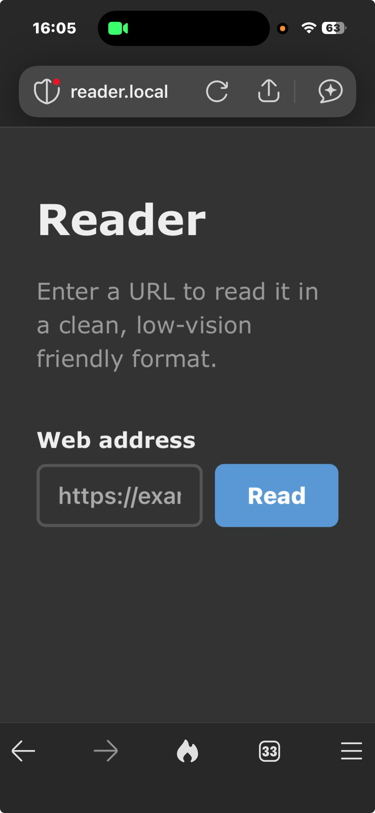
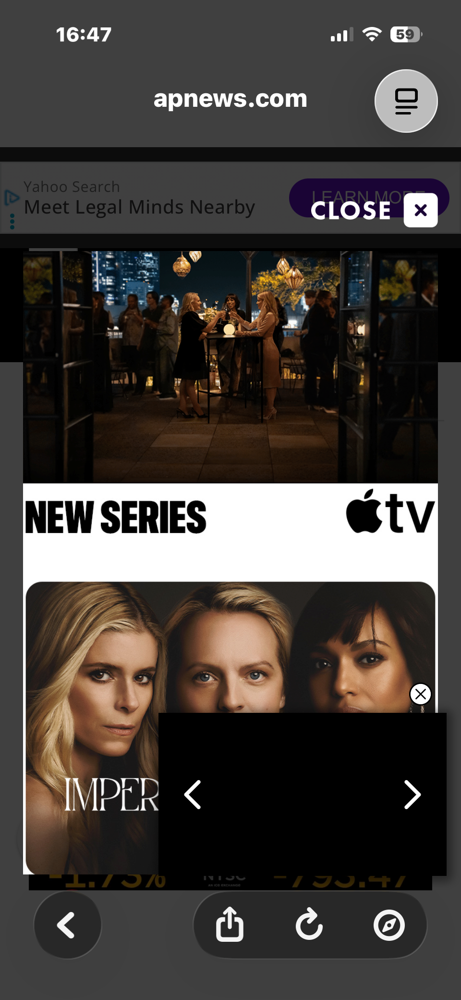
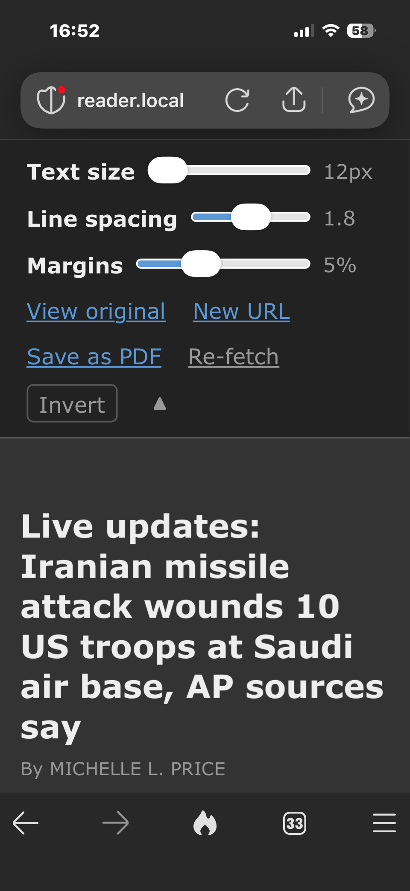

Reader
======

Reader is a vibe coded web application intended to make web pages readable for people with low vision. I know! We exist! It strips HTML elements such as ads, frames and overlays and preserves the text, similar to how Safari Reader used to work.

It works for both mobile browsers and desktop browsers. Style inspired by AO3's Reversi.

Links are preserved.

The user can:
* adjust font size, page margins and line height to suit.
* download as PDF.

The user uses it by entering a URL in a form.

iPhone
------

|----|----|
|  |  |
|  |  |

How it works
------------

Reader fetches pages server-side (dodging CORS entirely), runs them through [Mozilla Readability](https://github.com/mozilla/readability) — the same engine that powers Firefox Reader View — and re-renders the extracted content in a clean, configurable layout. The cleaned HTML is cached on first visit. PDFs are generated by a headless Chromium instance on the server and cached too, so repeated downloads are instant.

Install & Use (on macOS)
------------------------

### Install Multipass

You can certainly just run directly on your Mac, but here is a way to run on a VM using Multipass — useful if you want to serve Reader to other devices on your network without exposing your own machine.

```bash
brew install --cask multipass

# List your networks, pick an interface you like
# Replace en0 if needed
multipass networks

# Launch a VM with bridged networking, any device on your network
# can use your service
multipass launch --name reader --cpus 1 --memory 512M --disk 4G --network en0 20.04

# Copy the project into the VM
cd reader
multipass transfer -r . reader:/home/ubuntu

# Here's your VM!
multipass info reader
```

### Install Reader on VM & launch

```bash
# Shell into the VM
multipass shell reader

# Inside the VM:
./install.sh
./run.sh
```

`install.sh` installs Node.js, Chromium, and `avahi-daemon`. `run.sh` starts the server. The first startup takes a moment while Chromium initialises.

### Use the reader

The VM announces itself via mDNS, so you can open it by name on any device that supports `.local` (macOS, iOS, most Linux):

```
http://reader.local:3000
```

If `.local` doesn't work (some Android versions), fall back to the IP:

```bash
multipass info reader   # Look for the second IP — that's the bridged LAN IP
```

Open `http://<vm-ip>:3000` in your browser on your local machine or any device on your network.

Multipass reference
-------------------

[Multipass](https://canonical.com/multipass) uses Hyper-V on Windows, QEMU on macOS and Linux to start Ubuntu VMs.

```bash
multipass launch --name <name> --cpus 1 --memory 512M --disk 4G <ubuntu release>
multipass launch --name reader --cpus 1 --memory 512M --disk 4G --network <interface> <release>
multipass transfer -r <source> <name>:<dest>

multipass start <name>    # start VM
multipass stop <name>     # stop VM
multipass shell <name>    # shell in
multipass list            # see all VMs and their status
multipass info <name>     # IP address, resource usage
multipass delete <name>   # delete the VM
multipass purge           # free disk space after deleting
```

Expose to your local network with socat instead
-----------------------------------------------

On your **Mac** (not inside the VM), open a new terminal:

```bash
# Install socat if needed
brew install socat

# Get the VM's IP
multipass info reader   # note the IPv4 address

# Forward your Mac's port 3000 to the VM
socat TCP-LISTEN:3000,bind=0.0.0.0,fork TCP:<vm-ip>:3000
```

Get your Mac's LAN IP:

```bash
ipconfig getifaddr en0
```

Open `http://<mac-lan-ip>:3000` on any device on your network (phone, tablet, etc.).

Keep the socat terminal open while you're using it. `Ctrl+C` to stop forwarding.

Final thought
-------------

Maybe don't expose to the internet?
